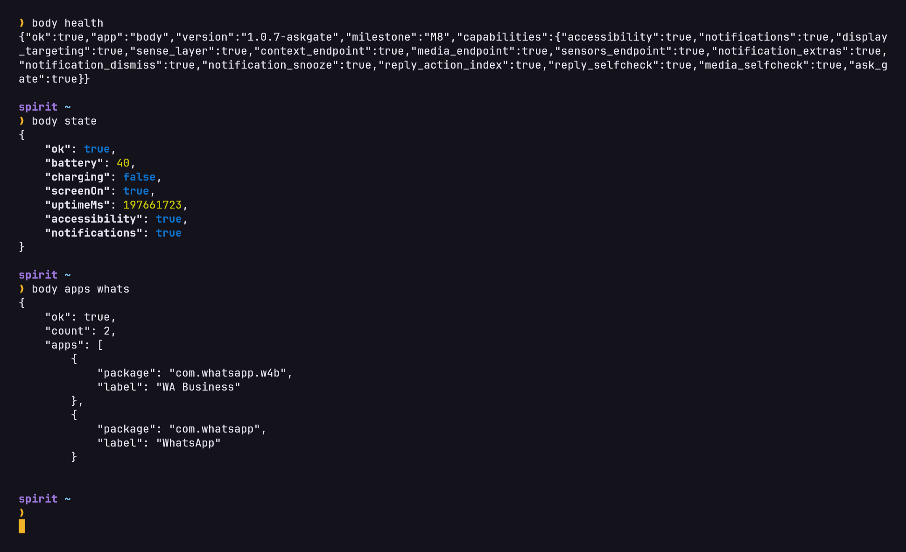

# the-body

An Android app that gives the AI agent on my phone a body. Eyes, hands, and a way to ask me things.

The agent is Claude Code, running in a Fedora that sits on top of Android through Termux and proot. That setup, and why anyone would do it, is a separate write-up: [spirit](https://github.com/beqa-beridze/spirit). This repo is only the app, and you need spirit's first two steps before any of this works.

A CLI agent in a proot can read files and hit APIs all day, but it's blind and it's got no hands. No screen, no taps, can't read a notification, can't answer a message. Termux:API does a bit of that and is flaky about the rest, so I wrote the missing part as a normal Android app.

- **Eyes.** An accessibility service reads whatever is on screen as a tree of elements with numbered ids, so the agent gets text and buttons instead of pixels. The notification listener reads notifications, including the messages inside them and who sent them.
- **Hands.** Tap, long press, type and scroll all work off an element id from the last read. Swipe takes a direction, back and home are key presses, and launching an app takes a package name. Everything reports back whether the screen actually changed.
- **A mouth.** It can reply to a messaging notification inline without opening the app, or send an SMS. Both take a two step confirmation so it can't fire one off by accident.
- It can ask me something. That's one route, `/ask`, which posts a loud yes/no notification with real buttons. It's a question or nothing, it can't use it to just tell me things, and it's capped at six an hour.
- Senses: battery, screen state, what's playing, and the phone's actual sensors.

All of it is a small HTTP API on `127.0.0.1:8765`, loopback only, behind a bearer token the app shows you and rotates on request. From inside the proot the agent just runs curl.

<p align="center">
  
</p>

## Getting it running

Minimum Android 8 (API 26), built against API 33, tested on exactly one phone, a Galaxy S26 Ultra on Android 16. You need Termux and a proot container first, which is steps 1 and 2 of [spirit's setup](https://github.com/beqa-beridze/spirit/blob/main/docs/setup.md). Starting from nothing, start there.

1. [Build the APK](docs/build.md) on the phone. No Android Studio, no Gradle. There's no prebuilt one to download and that's on purpose, reasons are in that doc.
2. [Install it and flip the six switches](docs/install.md) Android wants. The app walks you through them and reads four of them back from the OS so it knows they really took.
3. Copy the token out of the app, put it where the agent can read it, and keep [the API doc](docs/api.md) open while you poke at it.

Then from inside the proot:

```sh
body screen            # numbered list of what is on the display
body find "Send"       # just the elements matching that text
body tap 7-14          # tap that element, id exactly as body screen printed it
body notifs            # what is in the tray
```

`client/body` is that wrapper. It pretty-prints the screen so the agent doesn't have to chew through raw JSON. Drop it on PATH and point `BODY_TOKEN_FILE` at your token file.

The wrapper covers reading and acting. The gated routes, so SMS, notification replies and `/ask`, deliberately have no one-line verb because they need the two step handshake. Use `body raw` and `body rawpost`, or plain curl.

[docs/api.md](docs/api.md) has the full route list, every parameter and every error string. There's a table of every route near the top, start there.

## What's in here

```
app/            the Android app, Kotlin, no dependencies except nanohttpd
client/body     the shell wrapper I use from inside the proot
termux/         build scripts. fetch the toolchain once, then build the apk
docs/           the API reference, how to build, how to install
hermes-integration/  the same API as a plugin and a skill for the Hermes agent
                framework, from when I was trying that out. 18 tools with the
                safety rules written out. Ignore it if you use anything else
libs/           nanohttpd, the one jar this depends on
```

## The two bits that matter

Node ids carry a generation number. They come back looking like `7-14`, where 7 is which read they came from, and every read bumps that counter, so an action against an id from an older read gets refused instead of tapping whatever is sitting in that spot now. A bare `14` is still accepted for back-compat and skips the check, so don't use it. So read, then act on what you just read, then read again. Feels like overkill right up until it taps the wrong thing. Which it did.

The confirmation token is tied to the exact action. Ask to send an SMS and you get back a token and a summary of what it would send, nothing has gone out yet. Show that to the human, then call again with the token and identical parameters. Change the recipient or one character of the text and the token is worthless. Replies are also restricted to a compiled-in list of real messaging apps, so the agent can't answer your bank.

There's also multi-display support, which lets the agent read and work on a hidden virtual display while I keep using the phone normally. That part is experimental and Samsung fights it.

## The AI part

This app was built with AI help, most of it by Claude Code running on the phone it was being written for, which is a bit recursive but that's genuinely how it went. I did the design and the deciding, and all the testing happened on a real phone. The whole project is an agent and me sharing one machine, so it'd be strange to pretend otherwise.

## What's wrong with it

- One physical screen. When the agent drives the UI you're sat there watching it happen. The hidden-display work exists to fix that and it isn't finished.
- Samsung kills background services when it feels like it, even with battery optimisation off. The foreground service and the boot receiver get it back most of the time.
- It sees whatever is on your screen, and it does not filter or redact any of it. Screen text comes back exactly as the accessibility service read it, password fields included. Treat the token like a password, and that's why it's loopback only.
- Most failures come back as HTTP 200 with `"ok": false`, which is not what you'd expect. Read the `ok` field, not the status code.

MIT.
