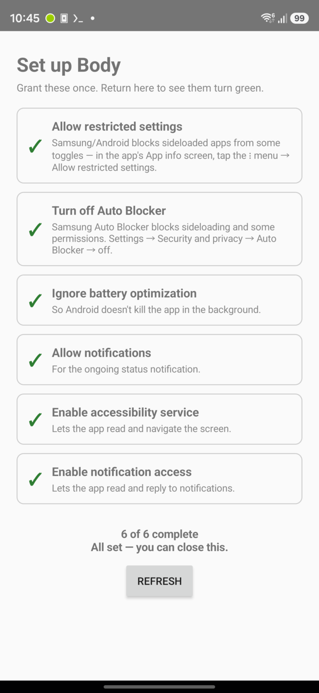

# Installing it and turning it on

Android won't let a sideloaded app read your screen and your notifications just because you asked, which is fair enough. There are six switches. The app has an onboarding screen that tracks all six and gives you a button that opens the right settings page for most of them, so you don't have to go hunting. Auto Blocker is the exception, that button only gets you as far as the general security settings, and on some phones it isn't there at all.

The app can check four of them against the OS so it knows if they're actually on. The other two it can't check, so you tick those off yourself.

1. **Allow restricted settings.** Do this one first, because it's what unblocks numbers 5 and 6 for a sideloaded app. App info, the three dot menu, Allow restricted settings.
2. **Turn off Auto Blocker.** Samsung only. Settings, Security and privacy, Auto Blocker. It blocks sideloading and quietly blocks some permissions too.
3. Ignore battery optimisation. Otherwise Android kills the service in the background and the bridge just stops answering.
4. Allow notifications. For the ongoing status notification and for the `/ask` alarm.
5. Enable the accessibility service. That's the one that lets the app read and navigate the screen.
6. Enable notification access. Lets it read and reply to notifications, and it's what makes the media endpoint work too.

<p align="center">
  
</p>

Open the app at least once. That is what starts the bridge, not the switches, so if you sideload it and never tap the icon then nothing is listening and `/health` below just times out. Once it says 6 of 6 complete, every capability is granted too. It comes back on boot after that.

## The token

Open the Bridge token screen in the app. It shows the token, there's a copy button, and a rotate button if you ever need it. Put it somewhere your agent can read:

```sh
# in TERMUX, not inside the Fedora container
mkdir -p ~/.config/body
echo 'PASTE_THE_TOKEN' > ~/.config/body/bridge_token
chmod 600 ~/.config/body/bridge_token
```

Termux's home, not Fedora's. The full path is `/data/data/com.termux/files/home/.config/body/bridge_token`, which is what `client/body` reads by default, and it's visible from inside the container at that same path so both sides find it. Write it into Fedora's `/root/.config` instead and the CLI quietly sends an empty token, you get a 401, and five of those in a minute trips the rate limiter below. Set `BODY_TOKEN_FILE` if you want it somewhere else.

Rotating takes effect immediately and every client on the old token starts getting 401s, so update them.

## Check it actually works

```sh
curl -s http://127.0.0.1:8765/health
```

`/health` needs no token on purpose, and it's how you tell "the bridge is dead" apart from "my token is wrong". It reports which capabilities are live, so if `accessibility` or `notifications` come back false, one of the switches above didn't take.

Then with the token:

```sh
TOK=$(cat ~/.config/body/bridge_token)
curl -s -H "Authorization: Bearer $TOK" http://127.0.0.1:8765/state
```

That's the real test, because `/state` is the cheapest route that actually requires auth.

Careful with the rate limiter while you're fiddling. Five failed auth attempts in a minute blocks the caller for five minutes, and since it all comes in over loopback that block hits every local client at once. If suddenly everything returns 429, that's what happened. Wait it out.

## Living with it

- The ongoing notification is the foreground service. If it disappears, Android killed the app and the bridge went with it.
- Samsung will still kill it every few days regardless of the battery setting. The boot receiver brings it back after a reboot, but a mid-day kill needs something watching from outside.
- After a reboot the bridge doesn't come back until you unlock the phone once, because that's when Android bothers to send the boot broadcast.

## Anything on the phone can talk to it

Worth being straight about this before you install it. The bridge listens on loopback, so nothing on your network can reach it, but loopback is not private on Android. Any other app on the same phone can open `127.0.0.1:8765`, and the bearer token is the only thing standing between it and a live feed of your screen and your messages.

That's why the token is 24 random bytes, why it's compared in constant time, why five bad attempts lock the port for five minutes, and why the token lives in a file you chmod rather than in an environment variable or a command line. If you don't trust everything installed on the phone, don't run this on it.

## Putting it back

Uninstall the app, from Settings or `pm uninstall com.beqa.body` over adb. That revokes the accessibility service and the notification access with it and drops the token. The Android settings you changed, battery optimisation and Samsung's Auto Blocker, go back the way they came, in the same screens.
